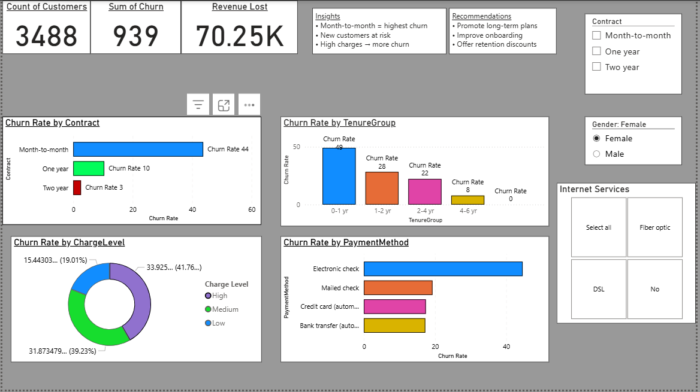

# Customer Churn Analysis  

## Overview  
This project focuses on understanding why customers leave a service (churn) and identifying the key factors behind it.  

I worked on this project end-to-end — starting from raw data cleaning to building an interactive dashboard and generating business insights. The goal was to analyze customer behavior and suggest ways to improve retention.  

---

## Tools Used  
- Python (Pandas, NumPy) – Data cleaning and preprocessing  
- SQL (MySQL) – Data analysis and querying  
- Excel – Intermediate data handling  
- Power BI – Dashboard creation and visualization  

---

## Data Cleaning  
Before analysis, the dataset required cleaning and preparation. The following steps were performed:

- Converted TotalCharges column to numeric format  
- Handled missing values and removed null records  
- Converted Churn column into binary format (1 = Yes, 0 = No)  
- Created new features such as TenureGroup and ChargeLevel  

---

## Analysis Performed  
The following analysis was conducted:

- Calculated overall churn rate  
- Analyzed churn by contract type  
- Studied churn across tenure groups  
- Compared churn based on monthly charges  
- Evaluated churn by payment methods  
- Estimated revenue loss due to churn  

---

## Key Insights  
- Customers with month-to-month contracts have the highest churn rate  
- New customers (0–1 year tenure) are more likely to leave  
- Customers with higher monthly charges tend to churn more  
- Certain payment methods show higher churn behavior  
- A significant amount of revenue is lost due to customer churn  

---

## Recommendations  
- Encourage customers to switch to long-term contracts  
- Improve onboarding experience for new customers  
- Review pricing strategies for high-paying customers  
- Introduce loyalty or retention programs  

---

## Dashboard  
An interactive dashboard was created in Power BI to visualize key metrics and insights.  

---

## Project Structure  

Customer-Churn-Analysis/
│
├── churn_analysis.ipynb
├── sql_queries.sql
├── dashboard.pbix
├── screenshot.png
└── README.md

---

## Conclusion  
This project demonstrates an end-to-end data analysis workflow, from data cleaning to visualization and business insights.  

It highlights how data-driven decisions can help reduce customer churn and improve overall business performance.
